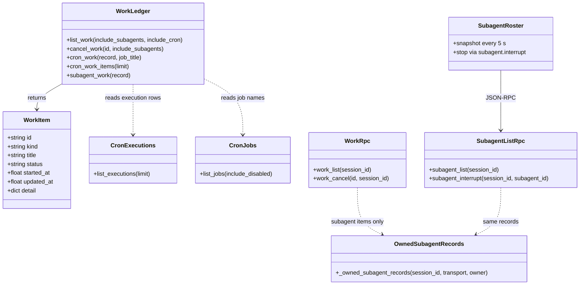
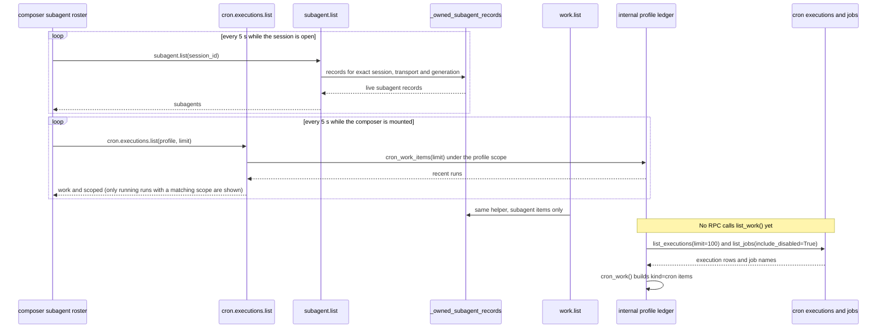

# Gap #7 / #8 系统设计：Work 台账（cron 执行记录）

> 本文取代 2026-10-10 的初稿。第 1 至 3 节描述本分支已经实现的内容，与代码一一对应。第 4 节是尚未实现的计划，其中的文件路径是拟定的，仓库里可能还不存在。
>
> **范围（2026-10-10 更新）：** 工作区概览面板已在提交 `69ef54d60b`（2026-10-06，token 缓存用量移到底栏）中退役，所以原先的“后台工作”区块从未挂载，已经从本分支移除。子代理仍由 composer 的子代理列表显示。本分支新增两件事：后端只读的 profile 级 `cron.executions.list`（授权沿用 cron.manage list），以及 composer 子代理列表里对运行中定时任务的只读展示（见 1.3 与 1.4）。

## 1. 已实现的部分

### 1.1 后端：cron 执行记录进入 Work 台账

数据来源是 `cron/executions.py::list_executions()`。它的持久化文件是 HERMES_HOME 下的 `cron/executions.db`，是 cron 执行历史的唯一真相源，不复制到 jobs.json 或内存中。

`tools/work_ledger.py` 的状态映射如下：

| 执行状态 | Work 状态 |
|---|---|
| `claimed`、`running` | `running` |
| `completed` | `completed` |
| `failed` | `failed` |
| `unknown` | `interrupted` |

- Work ID 为 `cron:<execution_id>`。没有 `id` 的记录直接跳过。
- `detail` 只保留白名单字段：`job_id`、`source`、`delivery_outcome`、`error`。`error` 在台账边界强制脱敏，调用的是 `redact_sensitive_text(force=True, redact_url_credentials=True)`。
- 标题固定为 `Cron job <job_id>`，不读取任务名。未显式命名的任务，任务名取自提示词的前 50 个字符，因此名字不能离开服务端。
- 账本文件不存在时返回空列表，读取路径不会创建它（`executions_db_exists`）。
- 执行记录读取失败时，记录 warning 并跳过 cron 项，其它工作照常返回（`cron_work_items`）。
- 取消：cron 执行派发后不可取消。`cancel_work` 对运行中的 cron 项返回 `unavailable`，对已结束的返回 `already_finished`。

### 1.2 协议

- `tui_gateway/contracts/work.py`：`WorkItem.kind` 增加 `cron`。
- `apps/shared/src/gateway-contract.generated.ts` 与 `gateway-contract.openrpc.json` 由 `scripts/gen_gateway_contracts.py` 生成。`tests/tui_gateway/contracts/test_generated.py` 会在它们过期时失败。

### 1.3 授权边界

- 公开 RPC `work.list`（`tui_gateway/methods_work.py::_work_list`）只返回当前 session、transport、generation 能证明归属的**活动子代理**。它调用 `subagent_work()`，**不调用** `list_work()`。
- 因此 cron 历史目前**不会**出现在界面里。`kind = cron` 是内部台账和协议的能力，并不代表 `work.list` 会返回 cron 项。
- `work.cancel` 对非子代理的 ID 返回错误 4001（无授权）。

**profile 级只读视图 `cron.executions.list`（已决定，后端已实现）**

- 授权：`profile` 的解析与 `cron.manage` list 相同（`_profile_home`），未知或已删除（墓碑）的 profile 返回 4064。它不要求 session、transport 或 generation 证明，因为数据不属于某个会话，而是 profile 自己的定时任务历史。能读到 cron.manage list 的调用方才能读到它，它不授予任何新权限。
- 绑定范围：函数体只绑定该 profile 的 HERMES_HOME（`_home_scoped_rpc`），不绑定密钥和终端环境。`_scoped_rpc` 会绑定这些，每次调用都会重新拉取外部密钥源，而桌面每 5 秒轮询一次，所以这里不能用它。
- 只读：没有新增、修改、暂停、删除或取消。定时任务派发后不可取消，`work.cancel` 对 cron 项的行为不变。
- 数据最小化：只返回白名单字段（work item 的 id、kind、title、status、started_at、updated_at，以及 detail 中的 job_id、source、delivery_outcome、error）。error 经 `redact_sensitive_text(force=True)` 脱敏。不返回提示词、投递目标、pid、process_id、输出或密钥。
- 数量：limit 默认 20，夹在 1 到 50 之间，按时间倒序。
- 响应中的 `scoped` 回显函数体实际运行所在的 profile；启动 profile 为空字符串。客户端发现不一致时应放弃结果。
- 后台进程不做 profile 级列表：`process.list` 是按会话限定的（live_session），保持不变。

### 1.4 composer 子代理列表（子代理部分原有；定时任务为新增的只读行）

composer 的子代理列表位于 `apps/desktop/src/app/chat/composer/status-stack/subagent-section.tsx`。

子代理部分（原有，未改动）：

- 数据来自 `use-subagent-snapshot.ts`：每 5 秒、以及窗口重新获得焦点时，调用 `subagent.list` 拉取快照；实时事件优先于快照。
- 每个子代理可以展开，发送转向消息（`subagent.steer`），或请求停止（`subagent.interrupt`）。
- `subagent.list` 与 `work.list` 都调用 `_owned_subagent_records(session_id, transport, owner)`，因此返回的是同一批子代理。

定时任务部分（新增，只读）：

- `use-running-cron-runs.ts` 调用 `cron.executions.list`，参数为 `{ profile, limit: 20 }`。profile 取当前活动连接的 profile；启动 profile 发送空字符串，与 cron.manage 的约定一致。
- 只显示 `status === 'running'` 的运行记录，每行是标题加“定时任务”标签，没有停止、转向或详情控件。
- 每 5 秒刷新一次，窗口获得焦点时也刷新；连续失败 3 次后停止轮询，失败期间不显示任何定时任务行。
- 响应里的 `scoped` 与请求的 profile 不一致时，整个响应丢弃。
- 会话本身没有记录所属的 profile，这里用的是当前活动连接的 profile，这是一个已知的近似。
- 没有子代理、只有定时任务在运行时，区块同样显示；标题计数改为“后台任务”的总数。

### 1.5 测试

- `tests/tools/test_work_ledger.py`：cron 归一化、白名单与脱敏、取消结果、执行记录不可读时的降级。
- `tests/tui_gateway/contracts/test_generated.py`：协议生成物是否为最新。

## 2. 类图（已实现）

## 3. 调用流程（已实现）

## 4. 尚未实现的计划

以下内容都没有合入本分支。文件路径是拟定的。

### 4.1 已实现

profile 级定时任务的只读 RPC 和 composer 中的只读展示都已实现，见 1.3 与 1.4。后台进程仍只按会话限定，不做 profile 级列表。

### 4.2 Gap #7：自然语言创建例程

- 已存在：`cron/jobs_schedule.py::parse_schedule`。
- 计划：新增薄包装 `parse_nl_schedule`，返回预览结构。解析失败时抛出可读的 `ValueError`，不写入错误任务。
- 计划：`cronjob_manage` 的 create 与 edit 增加 `dry_run` 参数。预览不落库。正式创建仍须经过现有的确认与授权上下文。
- 计划：deliver target 只在唯一可推断时自动填入，否则返回候选项让用户确认。

### 4.3 Gap #8：Approvals / Memory 工作台

- 后端已有：`approval.audit`，以及 `memory.list`、`memory.remember`、`memory.forget`（见 `tui_gateway/methods_memory.py` 与 `tui_gateway/methods_prompt.py`）。
- 计划：独立的工作台视图（`apps/desktop/src/app/workbench/` 目前不存在）。Approvals 按时间倒序排列。Memory 删除前需要二次确认，`memory.forget` 必须携带 `expected_text`。
- 计划：入口通过 `apps/desktop/src/app/contrib/wiring.tsx` 注册，具体位置待定。
- 已取消：“后台工作”区块（见文首）。

### 4.4 任务依赖（计划）

T01 接口与契约 → T02 解析与 dry-run → T03 台账与 cron 取消 → T04 Approvals / Memory 面板与入口 → T05 集成测试与回归。

## 5. 待明确事项

1. （已决定）profile 级定时任务执行历史的读取授权沿用 cron.manage list，见 1.3。后台进程仍只按会话限定，不做 profile 级列表。
2. cron 执行能否安全取消，取决于 runner 的归属与执行阶段。目前统一返回 `unavailable`。
3. dry-run 的确认令牌或提案哈希，如何与现有的 agent 提案机制对齐？
4. deliver target 的唯一性规则，以及候选项的展示格式。
5. Approvals / Memory 工作台的入口放在哪个区域（命令中心，还是独立 overlay）？

## 6. 共享约定

- RPC 为 JSON-RPC 2.0：成功返回 `result`，失败返回 `error`。后端使用 `_ok` 与 `_err`（`tui_gateway/server.py`）。
- Work ID 格式为 `<kind>:<opaque-id>`。
- 台账中的 `started_at` 与 `updated_at` 是 Unix 秒（浮点数），或为 null。界面负责格式化。
- 所有 work 请求都携带 `session_id`。不得通过移除授权检查来展示更多数据。
