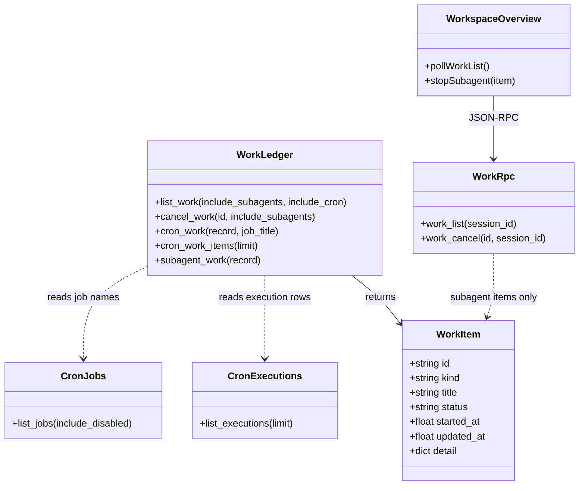
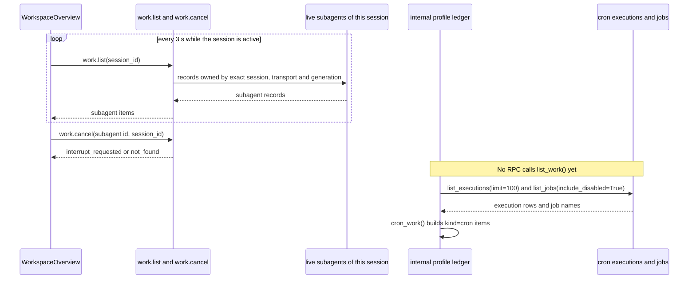

# Gap #7 / #8 系统设计：Work 台账与工作区后台工作

> 本文取代 2026-10-10 的初稿。第 1 至 3 节描述已经在本分支实现的内容，与代码一一对应。第 4 节是尚未实现的计划，其中的文件路径是拟定的，仓库里可能还不存在。
>
> **状态（2026-10-10）：桌面端的“后台工作”区块目前不会显示给用户。** 工作区概览面板（`workspace-overview.tsx`）已在提交 `69ef54d60b`（2026-10-06，token 缓存用量移到底栏）中退役：`registerWorkspaceOverviewPane()` 没有调用方，组件不会挂载，默认布局也不包含该面板。Electron 中的探测结果与此一致。是否恢复该面板，或把这一区块迁移到其它位置（例如 composer 中已有的子代理列表），需要主理人决定。

## 1. 已实现的部分

### 1.1 后端：cron 执行记录进入 Work 台账

数据来源是 `cron/executions.py::list_executions()`。它的持久化文件是 HERMES_HOME 下的 `cron/executions.db`，是 cron 执行历史的唯一真相源，不复制到 jobs.json 或内存中。

`tools/work_ledger.py` 的状态映射如下：

| 执行状态 | Work 状态 |
|---|---|
| `claimed`、`running` | `running` |
| `completed` | `completed` |
| `failed` | `failed` |
| `unknown` | `interrupted` |

- Work ID 为 `cron:<execution_id>`。没有 `id` 的记录直接跳过。
- `detail` 只保留白名单字段：`job_id`、`source`、`delivery_outcome`、`error`。`error` 在台账边界强制脱敏，调用的是 `redact_sensitive_text(force=True, redact_url_credentials=True)`。
- 标题取任务名。读不到任务名时回退为 `Cron job <job_id>`。
- 执行记录读取失败时，记录 warning 并跳过 cron 项，其它工作照常返回（`cron_work_items`）。
- 取消：cron 执行派发后不可取消。`cancel_work` 对运行中的 cron 项返回 `unavailable`，对已结束的返回 `already_finished`。

### 1.2 协议

- `tui_gateway/contracts/work.py`：`WorkItem.kind` 增加 `cron`。
- `apps/shared/src/gateway-contract.generated.ts` 与 `gateway-contract.openrpc.json` 由 `scripts/gen_gateway_contracts.py` 生成。`tests/tui_gateway/contracts/test_generated.py` 会在它们过期时失败。

### 1.3 授权边界（不变，也不得放宽）

- 公开 RPC `work.list`（`tui_gateway/methods_work.py::_work_list`）只返回当前 session、transport、generation 能证明归属的**活动子代理**。它调用 `subagent_work()`，**不调用** `list_work()`。
- 因此 cron 历史目前**不会**出现在界面里。`kind = cron` 是内部台账和协议的能力，并不代表 `work.list` 会返回 cron 项。
- `work.cancel` 对非子代理的 ID 返回错误 4001（无授权）。界面只会对子代理发起取消。

### 1.4 桌面：工作区的“后台工作”

实现位于 `apps/desktop/src/app/contrib/workspace-overview.tsx`。该组件目前没有被注册或挂载，见文首的状态说明，因此下列行为在应用中不可见，仅由单元测试覆盖：

- 通过 `useGatewayRequest` 调用 `work.list`，参数只有当前 `session_id`，结果渲染为 `WorkLedgerSection`。
- 停止按钮只出现在 `running` 且 `kind === "subagent"` 的项上。
- `work.cancel` 返回 `interrupt_requested`、`cancelled` 或 `already_finished` 时，从列表移除该项；返回其它结果（如 `unavailable`、`not_found`）时保留该项，界面不假装成功。
- 取消是协作式的。收到 `interrupt_requested` 之后，子代理可能仍在运行；下一次轮询会把它重新显示出来。
- 切换会话时立即清空列表。RPC 失败时清空列表并停止轮询（fail-closed），直到会话或网关变化后重新加载。
- 会话活跃期间每 3 秒轮询一次。快照没有变化时保留原数组引用，避免无谓更新。
- effect 的清理函数把 `disposed` 置位，丢弃切换前发出的异步响应。
- kind 和状态文案随界面语言切换（中文、繁体中文、英文）。

### 1.5 测试

- `tests/tools/test_work_ledger.py`：cron 归一化、白名单与脱敏、取消结果、执行记录不可读时的降级。
- `tests/tui_gateway/contracts/test_generated.py`：协议生成物是否为最新。
- `apps/desktop/src/app/contrib/workspace-overview.test.tsx`：切换会话后清空、轮询发现后来的工作、取消被拒时保留、cron 项没有停止按钮。

## 2. 类图（已实现）

## 3. 调用流程（已实现）

## 4. 尚未实现的计划

以下内容都没有合入本分支。文件路径是拟定的。

### 4.1 profile 级 cron 只读视图

如果工作区要展示 profile 级的 cron 历史，必须新增**独立且显式授权**的只读 RPC。不能通过放宽 `work.list` 的授权检查来实现。这一策略需要主理人确认（见第 5 节）。

### 4.2 Gap #7：自然语言创建例程

- 已存在：`cron/jobs_schedule.py::parse_schedule`。
- 计划：新增薄包装 `parse_nl_schedule`，返回预览结构。解析失败时抛出可读的 `ValueError`，不写入错误任务。
- 计划：`cronjob_manage` 的 create 与 edit 增加 `dry_run` 参数。预览不落库。正式创建仍须经过现有的确认与授权上下文。
- 计划：deliver target 只在唯一可推断时自动填入，否则返回候选项让用户确认。

### 4.3 Gap #8：Work / Approvals / Memory 工作台

- 后端已有：`approval.audit`，以及 `memory.list`、`memory.remember`、`memory.forget`（见 `tui_gateway/methods_memory.py` 与 `tui_gateway/methods_prompt.py`）。
- 计划：独立的工作台视图。目前 `apps/desktop/src/app/workbench/` 还不存在。Approvals 按时间倒序排列。Memory 删除前需要二次确认，`memory.forget` 必须携带 `expected_text`。
- 计划：入口通过 `apps/desktop/src/app/contrib/wiring.tsx` 注册，具体位置待定。

### 4.4 任务依赖（计划）

T01 接口与契约 → T02 解析与 dry-run → T03 台账与 cron 取消 → T04 面板与入口 → T05 集成测试与回归。

## 5. 待明确事项

1. 工作区是否允许查看 profile 级 cron 执行历史？这需要新的、显式授权的 RPC。
2. cron 执行能否安全取消，取决于 runner 的归属与执行阶段。目前统一返回 `unavailable`。
3. dry-run 的确认令牌或提案哈希，如何与现有的 agent 提案机制对齐？
4. deliver target 的唯一性规则，以及候选项的展示格式。
5. 工作台入口放在哪个区域（命令中心，还是独立 overlay）？

## 6. 共享约定

- RPC 为 JSON-RPC 2.0：成功返回 `result`，失败返回 `error`。后端使用 `_ok` 与 `_err`（`tui_gateway/server.py`）。
- Work ID 格式为 `<kind>:<opaque-id>`。
- 台账中的 `started_at` 与 `updated_at` 是 Unix 秒（浮点数），或为 null。界面负责格式化。
- 所有 work 请求都携带 `session_id`。不得通过移除授权检查来展示更多数据。
